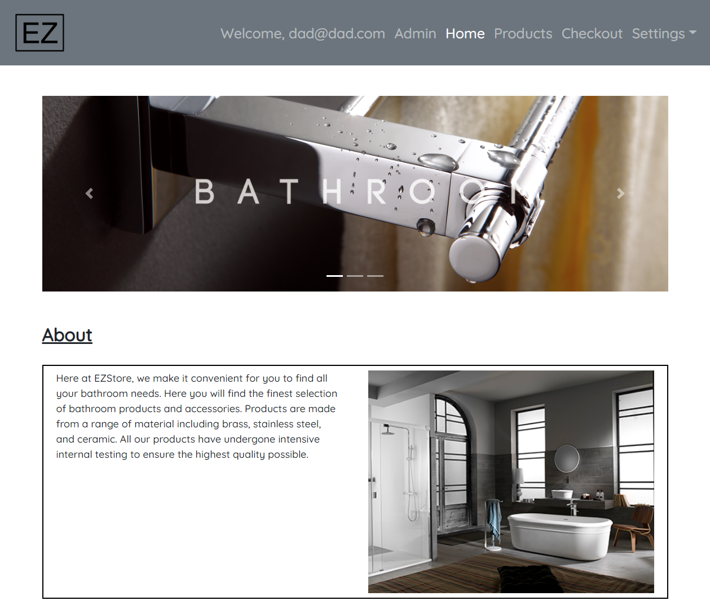
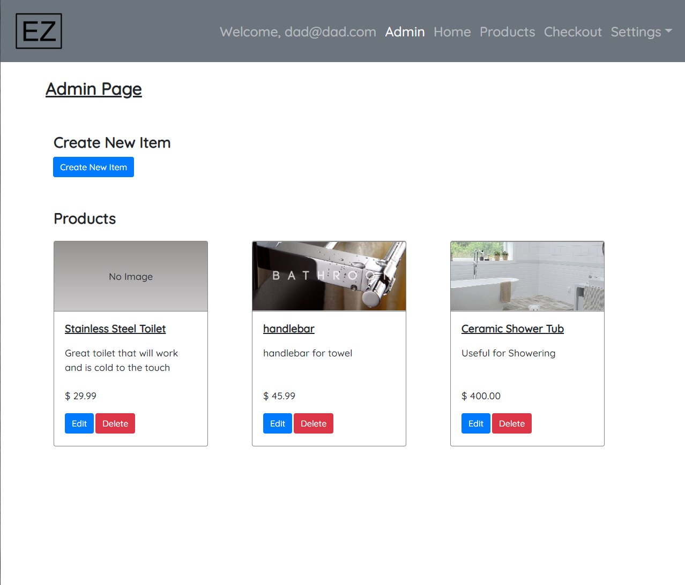
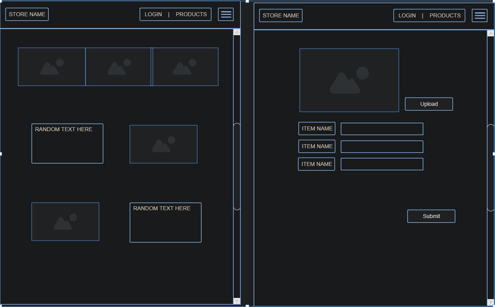

# EZStore-Client

## Links
- [Client App](https://philingyuup.github.io/EZStore-Client/){target="_blank"}
- [Client Repo](https://github.com/philingyuup/EZStore-Client){target="_blank"}
- [API App](https://ezstore-server.herokuapp.com/){target="_blank"}
- [API Repo](https://github.com/philingyuup/EZStore-Server){target="_blank"}

## Intro
EZStore is an e-commerce store that is customizable through admin abilities given to owners or staff members of the store. EZStore-Client is the store/app built using React, Cloudinary, and Axios. All users have a is_staff property (true/false). If you are a staff (is_staff=true), you will get access to the admin page to be able to add/delete product items from the page. As of right now, there is no way to change your is_staff status from the admin page (even if you're an owner). That has to be done with the django backpage. If you're interested in testing out the admin functions, please use the 'Admin-Login' button found in /sign-in/ (NOTE: please don't change the password once logged in as Admin).

## Planning Story
I wanted to make an e-commerce store that gives admin abilities for the owner and staff members of the site. The admin abilities include being able to edit the store, choose different templates/layouts, and upload products. Customers are also able to login and perform actions as a repeated customer (saved mailing address and credit cards). For the MVP, it'll just be the ability to CRUD products onto the page (as a staff member of the ecommerce store). Regular users (customers) won't be able to access the Admin page and only has read-only access to the server.

## Site



## User Stories
1. As a user I’d like an online store where I can display and sell my items
1. As a user I’d like to be able to add and delete new items
1. As a user I’d like to be able to adjust the price on items
1. As a user I’d like for my customers to be able to buy the items online
1. As a user I’d like for my customers to be able to checkout and buy items
1. As a user I’d like for my customers to be able to search for items

## Wireframe:


## Technologies Used
- React
- React-Bootstrap
- Cloudinary
- Axios
- NPM

## Future Features
- Database for the store (edit store)
- Different layouts for the store (owner's choose)
- Stripe integration (for payment)
- USPS Webtools (for shipment)
- Expand ```user``` and ```product``` databases

## Unsolved Problems
- Cloudinary server at the moment is unsigned, having a signed server w/ access keys will give my users more power over image uploading (such as deletion or maybe update)
- Cloudinary image deletion is a 10-minute delete_token issued upon a successful upload. This is a memory leak and can only be solved with using a 'signed' preset (currently, the preset is set to 'unsigned'). There is also no update ability (keep same url but different image file). Overall, this is not the worst thing as the staff users won't have access to the images. This also ensures my product object doesn't have stale image url links. There could be alot of unused images such as an image that was successfully uploaded, but unused and not deleted (i.e. You uploaded an image, don't like it, doesn't delete it, and uploads a new one. The previous image was not deleted and still remains in the cloudinary server as a stale file. You could also upload an image, not delete the image and press the back button on the browser.)
- Some unmounting errors are occuring (nothing affecting the main functionality of the app)

## Issues Encountered
This is my first *personal* project using React. Overall the language is pretty straightforward but the way components and states work require a good amount of planning to get the template correct. I had to refactor my code a few times because my states weren't properly stored in the parent component. Overall I really liked using React but I would've enjoyed it more if I had the knowledge/capability to properly architect the app beforehand. I also ran into a problem trying to pass props to a hooks component. This was solved using ```render={(props)} => <ExampleComponent {...props} />```. There also weren't a lot of specific hooks information available online due to it being relatively new.
